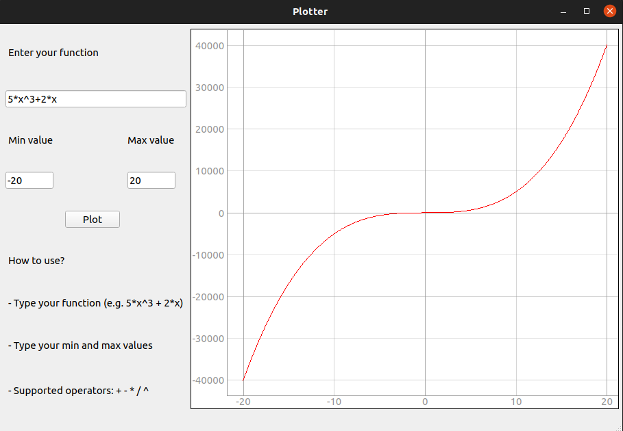
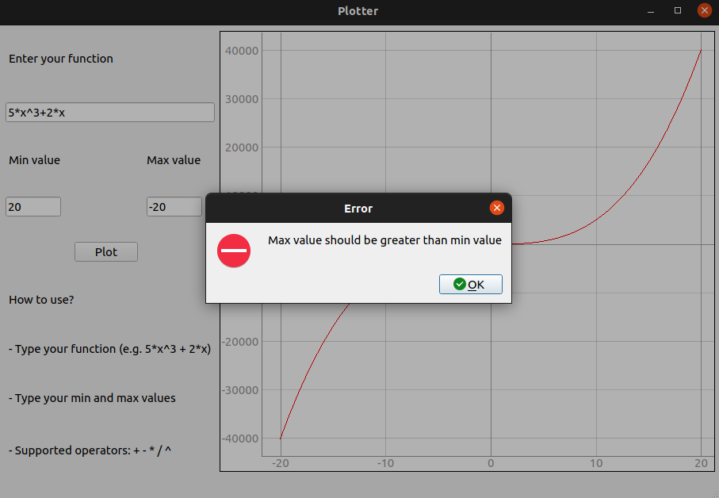
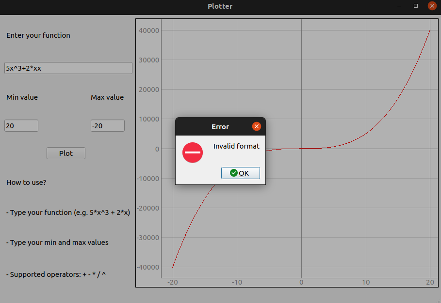
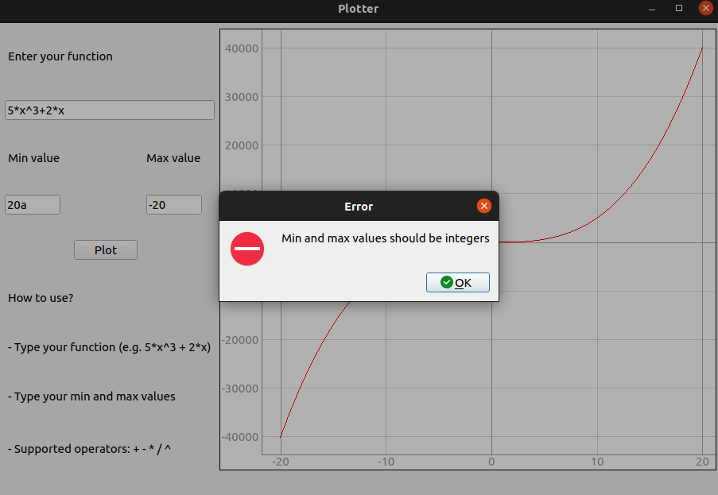

# Plotter

## About The Task

Plotter is a GUI application that plots a user-input function with minimum and maximum x values.

## Built with

-[python](https://www.python.org/)

-[Qt](https://doc.qt.io/qtforpython/)

-[pytest-qt](https://pytest-qt.readthedocs.io/en/latest/intro.html)

## Getting Started

### Installation

1.**_Clone the repository_**

```sh
$git clone https://github.com/Ta7a21/plotter
```

2.**_Navigate to repository directory_**

```sh
$cd plotter
```

3.**_Install dependencies_**

```sh
$pip install PyQt5
$pip install numpy
```

### Running

1.**_Running the application_**

```sh
$python app.py
```

2.**_Running the tests_**

```sh
$pytest test.py
```

### Desktop Screenshots
  




  